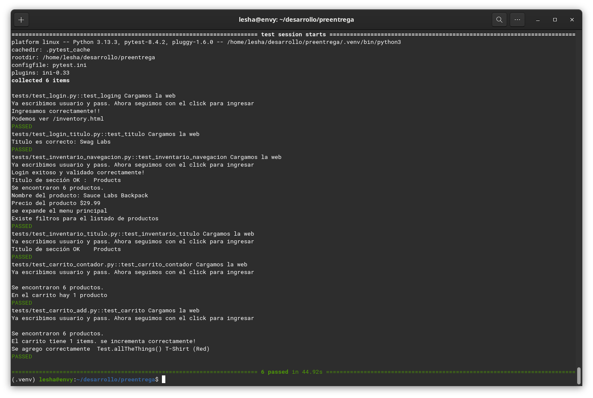

# Pre-entrega Proyecto Final - Automatización de Testing

Proyecto de automatización de pruebas para el sitio SauceDemo, utilizando Selenium WebDriver y Python.


## 🎯 Propósito del Proyecto

El objetivo es automatizar los siguientes flujos en la aplicación SauceDemo:

- Login con credenciales válidas e inválidas
- Verificación del catálogo de productos
- Interacción con el carrito de compras (añadir productos y verificar su contenido)
- Verificación de existencia del menu y otros elementos del sitio

## 🛠️ Tecnologías Utilizadas

- **Python**: Lenguaje de programación principal
- **Pytest**: Framework de testing para estructurar y ejecutar pruebas
- **Selenium WebDriver**: Para la automatización de la interfaz web
- **Git/GitHub**: Para control de versiones y compartir el código

## 📁 Estructura del Proyecto

preentrega_G.oliverio/

        ├── images/     # Carpeta con capturas de pantalla
        ├── tests/      # Carpeta contenedora de los diferentes tests y funciones
            ├── Objects # Carpeta contenedora del archivo Register con datos necesarios para realizar los test.
            └── baseActions  # Carpeta contenderod de distintas funciones reutilizables      
        ├── conftest.py # Configuraciones adicionales para pytest 
        ├── helpers.py  # Funciones auxiliares reutilizables
        ├── run_test.py # Aplicacion para la ejecucion de todos los tests
        ├── pytest.ini  # Archvivo configuracion pytest
        ├── Requirements.txt # Requerimientos para ejecutar los tests
        └── READNE.md   # Este archivo

## ⚙️ Instalación de Dependencias

1. Asegúrate de tener Python 3.7 o superior instalado.
2. Instala las dependencias necesarias:

pip install selenium pytest pytest-html

Descarga el WebDriver correspondiente a tu navegador:

ChromeDriver

GeckoDriver (Firefox)

Asegúrate de que el WebDriver esté en tu PATH o especifica su ubicación en el código.

### ▶️ Ejecución de las Pruebas
Para ejecutar todas las pruebas:
python3 -m pytest runtest.py

Para generar un reporte HTML:
El reporte se genera automaticamente. Se puede cancelar esta opcion desde pytest.ini

### ✅ Funcionalidades Implementadas

1. Automatización de Login
   Caso de éxito con credenciales válidas

2. Verificación del Catálogo
   Comprobación del título de la página
   Verificación de presencia de productos
   Validación de elementos de la interfaz (menú, filtros, etc.)

3. Interacción con el Carrito
   Añadir producto al carrito
   Verificar que el contador se incremente

4. Navegar al carrito

5. Comprobar que el producto añadido aparezca correctamente en el carrito de compras

### ✨ Características Adicionales

### Funciones auxiliares reutilizables: En los archivos:

    └── tests/      
        └── baseActions
            ├── acciones_base.py
            └── usuario_acciones.py


### Datos modificables para reutilizar la aplicaciones en caso de una nueva version: En el archivo:

    └── tests/      
        └── Objects
            └── Register.py


## 💾 Instalación

No es necesario instalar los test. Solo crea una carpeta, descarga los archivos y ejeculta run_test.py

```bash
  mkdir dir_app
  cd dir_app
  git clone https://github.com/Goliverio/preentrega_G.oliverio.git
  py -m pytest run_tests.oy
```

## 📷 Screenshot de logs
 

## 👤 Autor
## Gonzalo Oliverio
#### gonzalo [at] oliverio.com


## 📝 Notas
Este proyecto fue desarrollado como pre-entrega para el curso de Automatización de Testing.
Todas las pruebas están diseñadas para funcionar con el sitio web SauceDemo en su versión actual.


    