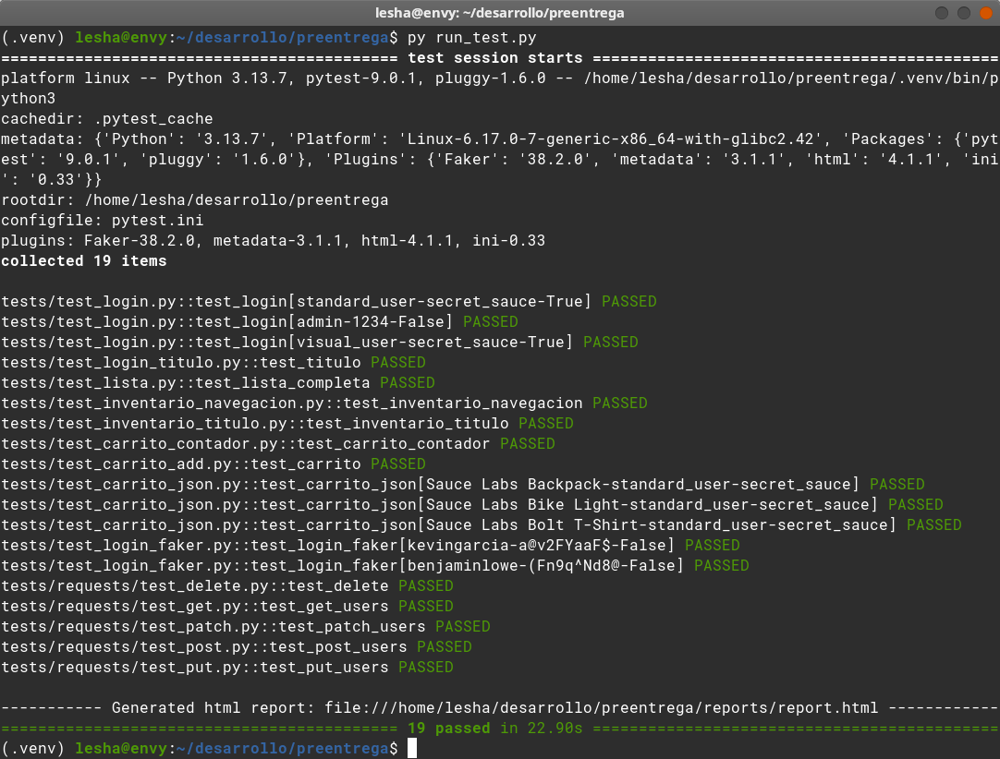
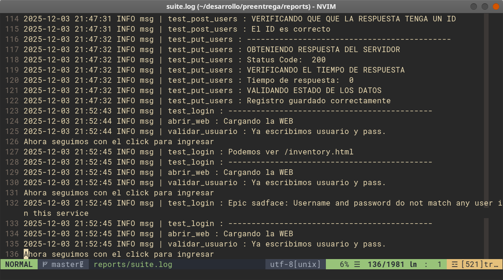

# Proyecto Final - Automatización de Testing

Proyecto de automatización de pruebas para el sitio SauceDemo, utilizando Selenium WebDriver y Python.
Automatización de pruebas API REST por medio la librería Requests


## 🎯 Propósito del Proyecto

El objetivo es automatizar los siguientes flujos en la aplicación SauceDemo y pruebas API REST sobre reqres.in.

- Login con credenciales válidas e inválidas
- Verificación del catálogo de productos
- Interacción con el carrito de compras (añadir productos y verificar su contenido)
- Verificación de existencia del menu y otros elementos del sitio

## 🛠️ Tecnologías Utilizadas

- **Python**: Lenguaje de programación principal
- **Pytest**: Framework de testing para estructurar y ejecutar pruebas
- **Selenium WebDriver**: Para la automatización de la interfaz web
- **Librería Requests**: Para la automatización de pruebas de API
- **Git/GitHub**: Para control de versiones y compartir el código

## 📁 Estructura del Proyecto

preentrega_G.Oliverio/

        ├── images/             # Carpeta con capturas de pantalla de la aplicación
        ├── reports/            # Carpeta logs de la aplicación
            └── screens         # Screenshot de tests fallidos 
        ├── tests/              # Carpeta contenedora de los diferentes tests y funciones
            ├── baseActions     # Carpeta contenderod de distintas funciones reutilizables
            ├── Objects         # Carpeta contenedora con datos necesarios para realizar los test.
            ├── requests        # Conjunto de test de API sobre reqres.in
            └── utlis           # Herramientas complementarias para los distintos tests
        ├── conftest.py         # Configuraciones adicionales para pytest 
        ├── run_test.py         # Aplicación para la ejecucion de todos los tests
        ├── pytest.ini          # Archvivo configuracion pytest
        ├── Requirements.txt    # Requerimientos para ejecutar los tests
        └── READNE.md           # Este archivo

## ⚙️ Instalación de Dependencias

1. Asegúrate de tener Python 3.7 o superior instalado.
2. Instala las dependencias necesarias:
    ```bash
    pip install -r requirements.txt
    ```
3. Descarga el WebDriver correspondiente a tu navegador:
ChromeDriver o GeckoDriver (Firefox) son los mas comunes.
    ```bash
    pip install webdriver-manager
    ```
Asegúrate de que el WebDriver esté en tu PATH o especifica su ubicación en el código.


### ✅ Tests Implementados:


    └── tests/      
        └── Requests                        # Conjunto de test de API sobre reqres.in
        |   ├── test_delete.py
        |   ├── test_get.py
        |   ├── test_patch.py
        |   ├── test_post.py
        |   └── test_put.py
        |                                   # Conjunto de test sobre https://www.saucedemo.com/
        ├── test_carrito_add.py
        ├── test_carrito_contador.py
        ├── test_carrito_json.py            # Pruebas sobre el carrito de compras utilizando JSON
        ├── test_inventario_navegacion.py
        ├── test_inventario_titulo.py
        ├── test_lista.py                   # Test de validacion del lector CSV
        ├── test_login.py
        ├── test_login_faker.py             # Test de login implementando faker para datos aleatorios
        └── test_login_titulo.py

[//]: # ()
[//]: # (1. Automatización de Login)

[//]: # (   Caso de éxito con credenciales válidas)

[//]: # ()
[//]: # (2. Verificación del Catálogo)

[//]: # (   Comprobación del título de la página)

[//]: # (   Verificación de presencia de productos)

[//]: # (   Validación de elementos de la interfaz &#40;menú, filtros, etc.&#41;)

[//]: # ()
[//]: # (3. Interacción con el Carrito)

[//]: # (   Añadir producto al Carrito)

[//]: # (   Verificar que el contador se incremente)

[//]: # ()
[//]: # (4. Navegar al carrito)

[//]: # ()
[//]: # (5. Comprobar que el producto añadido aparezca correctamente en el carrito de compras)

### ✨ Características Adicionales

### Funciones auxiliares reutilizables: 

    └── tests/      
        └── baseActions
            ├── acciones_base.py
            ├── cart_page.py
            ├── inventory_page.py
            └── usuario_acciones.py
        └── utils
            ├── lector_json.py
            └── logger.py


### Datos modificables para reutilizar la aplicación en caso de una nueva version:

    └── tests/      
        └── Objects
            ├── data_login.csv               # Archivo con datos de login
            ├── productos.json               # Archivo con informacion sobre productos
            ├── register.py                  # Variables y Constantes.
            └── requests_data.py             # Datos para realizar las pruebas de API


## 💾 Instalación:

No es necesario instalar los test. Solo crea una carpeta, descarga los archivos y ejeculta run_test.py

```bash
  mkdir dir_app
  cd dir_app
  git clone https://github.com/Goliverio/preentrega_G.oliverio.git
```  

### ▶️ Ejecución de las Pruebas
Para ejecutar todas las pruebas:

```bash
python3 runtest.py
```

Reporte HTML:

El reporte se genera automaticamente. Se puede cancelar esta opcion desde pytest.ini


## 🏗️ Modo de uso: 

```bash
  py run_tests.py --help
  
  Usage: python run_test.py -m [marker a ejecutar]  [OTRAS OPCIONES]

  Los MARKERS disponibles son:
            Low:    Test de baja prioridad
            Medium: Test de prioridad media
            High:   Test de prioridad alta
            Api:    Pruebas de APi
            JSON:   Pruebas JSON
    Si no se especifica ningún MARKER se ejecutan todas las pruebas. 
```

## 📷 Screenshot de la consola
 


## 📷 Screenshot de logs
 


## 👤 Autor
## Gonzalo Oliverio
#### gonzalo [at] oliverio.com


## 📝 Notas
Este proyecto fue desarrollado como entrega para el curso de Automatización de Testing.
Todas las pruebas están diseñadas para funcionar con el sitio web SauceDemo en su versión actual.


    